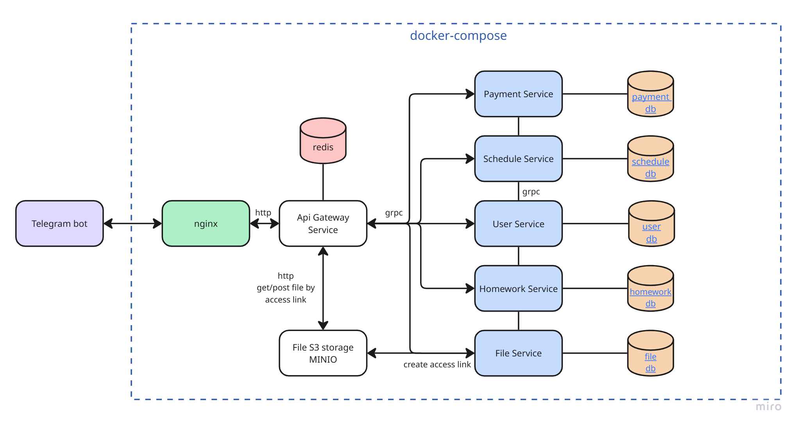

# StudyFlow

## Идея

StudyFlow — это API-платформа для организации взаимодействия между репетиторами и учениками с возможностью интеграции в Telegram-бота.

Каждый репетитор может:

- назначать занятия
- добавлять доступные слоты времени
- публиковать домашние задания
- оценивать их
- принимать оплату за занятия от учеников

Ученики могут: 
- бронировать уроки
- отправлять решения
- получать обратную связь
- прикреплять чеки об оплате

## Архитектура



- Микросервисы на Go
- gRPC для внутреннего API
- REST API Gateway для внешних клиентов
- PostgreSQL, Redis, S3-compatible storage
- Telegram-бот как основной клиент

## Сервисы

### [user-service](user_service/README.md)

Управляет пользователями, Telegram-аккаунтами, репетиторами и учениками. Обрабатывает авторизацию, приглашения, CRUD по всем моделям.

### [schedule-service](schedule_service/README.md)

Отвечает за график и уроки. Репетитор может задавать слоты, а ученик бронировать. Уроки можно редактировать и отменять.

### [homework-service](homework_service/README.md)

Работа с домашними заданиями. Репетитор добавляет задания, ученик отправляет решения, репетитор отправляет отзыв.

### [payment-service](payment_service/README.md)

Управляет оплатами: ученик отправляет чек, репетитор его подтверждает.

### [file-service](file_service/README.md)

Отдельный сервис доступа к S3: занимается  генерацией signed URL.

## Запуск

1. Добавьте переменную окружения `TELEGRAM_SECRET` в `.env`
2. Запустите проект командой:

```bash
docker-compose up
```

## Авторизация через Telegram

Telegram-бот формирует `Authorization` header следующим образом:

- `message = "{telegram_id}:{utc_timestamp(seconds)}"`
- `key = bot_token`
- HMAC: `hmac(message, key).hex()`

Заголовок:

```
Authorization: telegram {telegram_id}:{utc_timestamp}:{hmac}
```

### API Gateway: AuthMiddleware

- Извлекает данные из заголовка
- Делает запрос в `user_service.AuthorizeByAuthHeader`
- Добавляет `x-user-id` и `x-user-role` в gRPC-контекст запроса

### user\_service.AuthorizeByAuthHeader

- Проверяет timestamp (±5 минут от текущего UTC) — защита от replay-атак
- Валидирует HMAC с использованием `telegram_secret`
- Ищет пользователя по Telegram ID в базе
- Возвращает информацию о пользователе

## Работа с файлами

### Загрузка

1. Клиент отправляет запрос в `file-service` на создание файла. В ответ получает `file_id` и ссылку на загрузку.
2. Ссылка ведёт на API Gateway и далее проксируется в MinIO.
3. Клиент загружает файл по ссылке.
4. `file_id` используется при создании сущности (например, чек или домашнее задание).

### Получение

1. Клиент запрашивает файл через нужный сервис (например, `payment_service.GetReceiptFile`).
2. Сервис проверяет доступ и запрашивает ссылку в `file-service`.
3. В ответ клиент получает ссылку доступа.
4. Ссылка также ведёт через API Gateway и проксируется в MinIO.

## Приоритетный поиск данных (параметры занятий)

Некоторые параметры — например, реквизиты, ссылки на занятия, цены — могут задаваться на разных уровнях. При выборе значения используется **приоритетный порядок**:

1. **Конкретный урок** — максимальный приоритет (репетитор может переопределить условия при создании или редактировании урока)
2. **Пара репетитор–ученик** — задаётся при приглашении или позже через меню учеников
3. **Общие данные репетитора** — указываются при регистрации и доступны в настройках

Бизнес-логика всегда использует наиболее приоритетное доступное значение.

