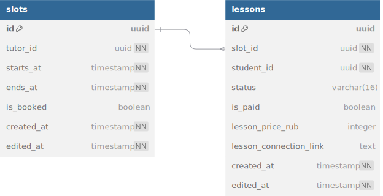

# schedule-service

## Описание

Сервис отвечает за хранение и управление расписанием репетитора, а также бронирование слотов учениками. Поддерживает два уровня сущностей: слоты (временные интервалы) и конкретные уроки (связанные с пользователями).

Аутентификацию и авторизацию обеспечивает API Gateway, который прокидывает user_id и user_role в gRPC Context.

---

## Инфа по реализации

- поле `is_booked` в слотах избыточно, но оставлено для оптимизации
- каждый слот может быть использован только один раз (unique constraint на slot_id в lessons)

---

## База данных

### связи с базами данных других сервисов

- tutor_id, student_id => users_db.users.id

---

## Описание gRPC методов

(подробнее со всеми request/response message смотрите в proto файле)

### CreateSlot
Возможные ошибки:
- INVALID_ARGUMENT: поля невалидны (в тч проверка на время: начало раньше конца, всё в будущем)
- PERMISSION_DENIED: не репетитор

Создаёт свободный слот времени для репетитора.

### DeleteSlot
Возможные ошибки:
- INVALID_ARGUMENT: поля невалидны
- NOT_FOUND: слот не найден
- PERMISSION_DENIED: не владелец

Удаляет слот и, если есть, связанный lesson

### ListSlotsByTutor
Возможные ошибки:
- INVALID_ARGUMENT: поля невалидны
- PERMISSION_DENIED: доступ к чужому расписанию

Возвращает список всех слотов преподавателя, в т.ч. уже занятые. Используется для отображения расписания в интерфейсе.

### CreateLesson
Возможные ошибки:
- NOT_FOUND: слот не существует
- ALREADY_EXISTS: слот уже занят
- PERMISSION_DENIED: нельзя создавать урок в чужом слоте
- FAILED_PRECONDITION: tutor_id и student_id не состоят в связке

Создаёт урок в свободном слоте. Репетитор указывает ученика.

### CancelLesson
Возможные ошибки:
- NOT_FOUND: урок не найден
- PERMISSION_DENIED: не участник урока

Отменяет урок. Изменяет статус, не удаляет физически.

### CompleteLesson
Возможные ошибки:
- NOT_FOUND: урок не найден
- PERMISSION_DENIED: не репетитор

Помечает урок как завершённый.

### ListLessonsByTutor
Возможные ошибки:
- PERMISSION_DENIED: доступ к чужому расписанию

Возвращает список всех уроков репетитора.

### ListLessonsByStudent
Возможные ошибки:
- PERMISSION_DENIED: доступ к чужому расписанию

Возвращает список всех уроков ученика.

### GetLessonById
Возможные ошибки:
- NOT_FOUND: урок не найден
- PERMISSION_DENIED: не участник урока

Получает подробную информацию об одном конкретном уроке.

